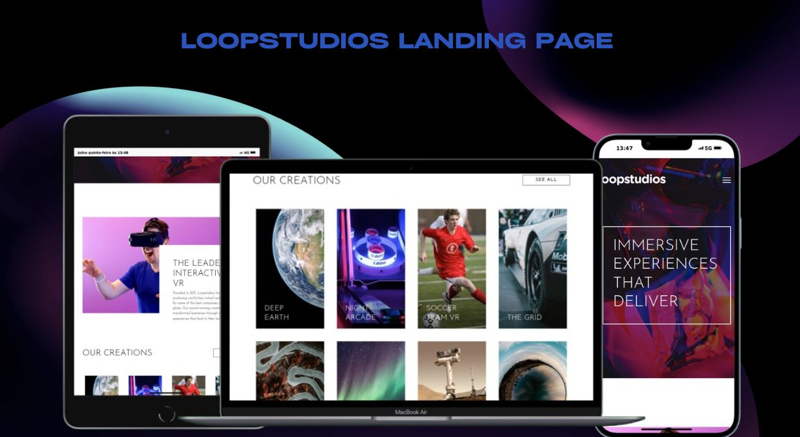

<h1 align="center">LoopStudios - Font-End Mentor Desafio</h1>
<div align="center">
  <a href="#descrição">Descrição</a> |
  <a href="#iniciar">Iniciar</a> |
  <a href="#licença">Licença</a>
</div>

<p align="center">
  
</p>
<p>
 
</p>

## Descrição

O Site e uma landing page que apresenta uma interface moderna e elegante, voltada para serviços de torna as visível as empresas no mundo virtual, sendo esse um dos pontos que, atualmente e indispensavel para empresas que, visam crescer em um mundo competitivo.

Acesse o site **[LoopStudios](https://loop-studios-lac.vercel.app)**.

## Iniciar

E Necessário ter o Nodejs e o git instalado.

Faça clone do repositório localmente.

```bash
git clone https://github.com/matheus369k/loop-studios.git
cd ./loop-studios
```

Instale as dependencias

```bash
npm i
```

Agora você pode iniciar o projetos

```bash
npm run dev
```

## Licença

Licença usada **[MIT](./LICENSE.txt)**
